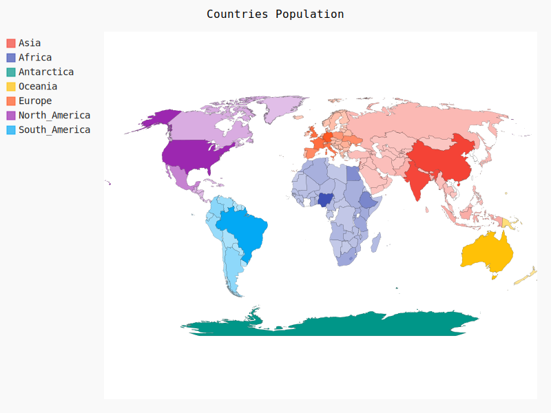

# World Population Visualization with Pygal

This project visualizes country-wise population data on a world map using Pygal.
Countries are grouped by continent, and population values are displayed using color intensity on an SVG world map.

## Features

- Reads population data from a JSON file
- Converts country names to ISO country codes
- Groups countries by continent
- Displays population data on a world map
- Exports the visualization as an SVG file

## Technologies Used

- Python 3
- Pygal
- JSON
- SVG visualization

## Data Source

The project expects a JSON file named:

country-by-population.json

Sample Format
```bash
[
  {
    "country": "Nepal",
    "population": 30547580
  },
  {
    "country": "India",
    "population": 1428627663
  }
]

# How to Run the Project
1. Install Dependencies
    ```bash
    pip install pygal pygal_maps_world

2.  Run the Script
    ```bash
    python main.py    

3. Output

After running the script, an SVG file will be generated:

Population.svg

Open it in any web browser to view the world population map.



## Learning

- Pygal World Map Visualization
- JSON file read
- Python Dictionary, Functions, File reading

